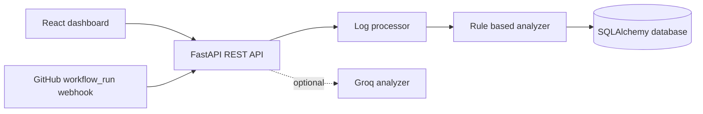

# Architecture

PipelineMedic is a React/Vite client backed by a FastAPI service. The API processes untrusted CI logs, redacts likely secrets, classifies failures using weighted rules, and stores reports through SQLAlchemy. SQLite is the default local store; PostgreSQL is supported through `DATABASE_URL` and Compose.

Demo flow: form or file -> validation -> ANSI/timestamp cleanup and redaction -> evidence extraction -> weighted classification -> database -> result/history APIs.

Webhook flow: raw body -> HMAC verification -> event filtering -> failed run deduplication -> queued processing -> optional GitHub archive retrieval -> redacted analysis persistence.

AI fallback: rule-based analysis is always available. Groq responses are schema-validated and evidence is restricted to extracted log lines before persistence.
