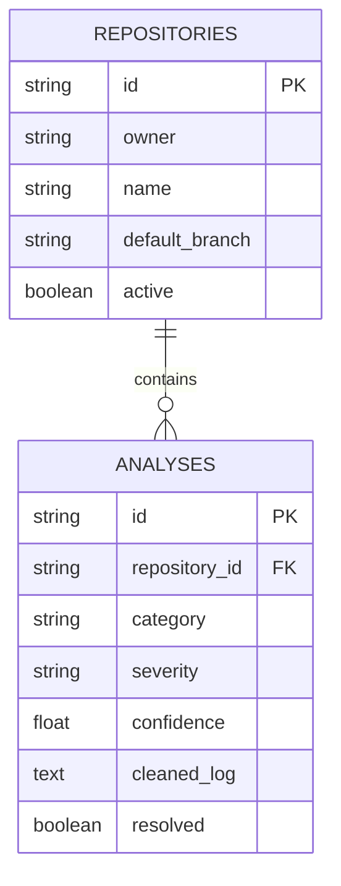

# Database Schema

The MVP has `repositories` and `analyses` tables. A repository has many analyses; an analysis stores source, category, severity, confidence, evidence excerpt, cleaned log, resolution state, and workflow metadata. IDs are UUID strings and timestamps are timezone-aware.

PostgreSQL is the intended deployment database. pgvector and separate workflow/action/feedback tables remain planned extensions.
